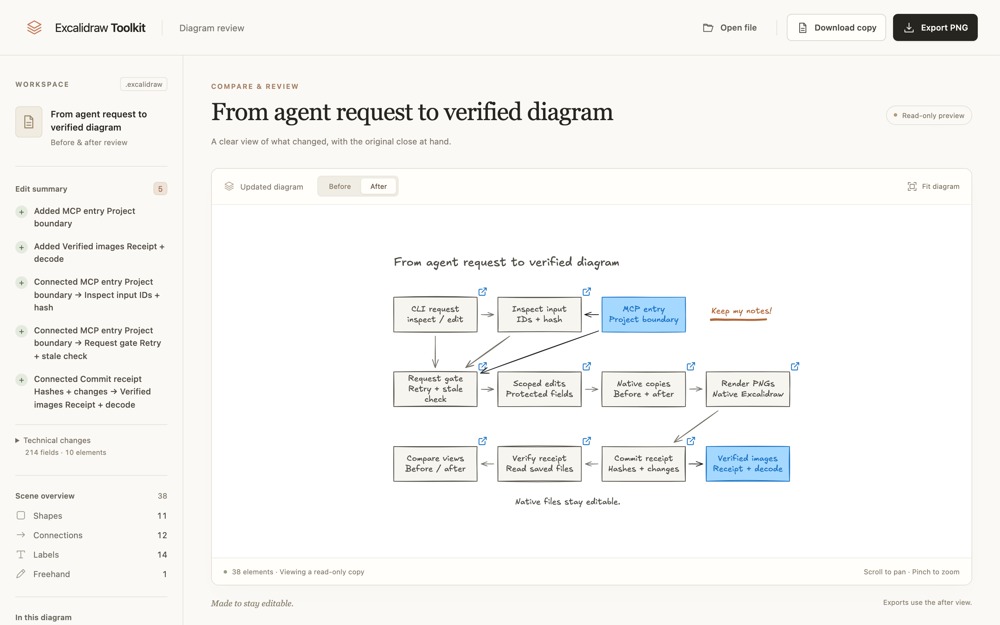
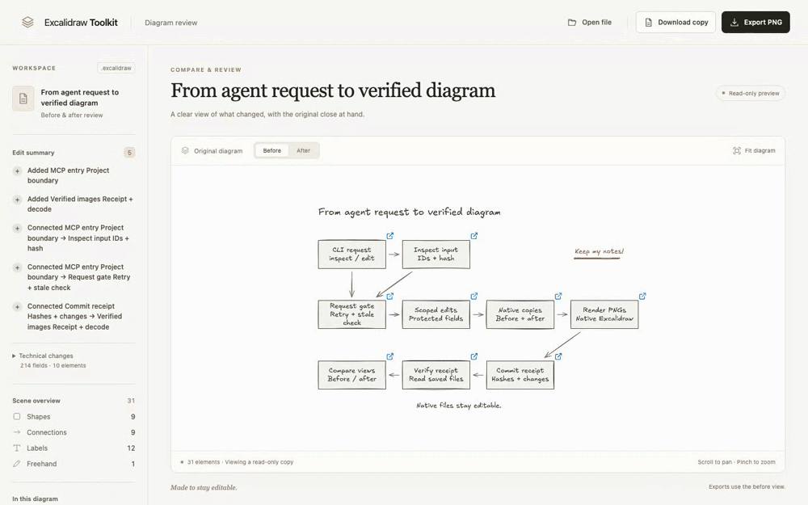

# Excalidraw Toolkit

**Edit the diagram you already have. Keep the work you put into it.**

Use Claude Code or Codex to update saved Excalidraw diagrams, review the changes,
and keep an editable result. Your original file, manual notes, images, and
unrelated layout stay intact.

[](https://edwingao.com/excalidraw-toolkit)

**[Explore the toolkit →](https://edwingao.com/excalidraw-toolkit)** · [Watch the real workflow](https://edwingao.com/excalidraw-toolkit#see-the-workflow) · [Get started](#get-started)



> Extend this architecture diagram with the MCP interface in `src/scoped-mcp.js`.
> Show where agent requests enter and how verified images come back. Preserve
> the existing pipeline, layout, and notes.

The agent inspects existing elements, applies supported edits by ID, and returns
an edited `.excalidraw` copy with before/after PNGs and a change receipt.

This real Codex/MCP edit extends a nine-stage diagram of this repository into an
eleven-stage overview. The blue additions show the existing MCP interface;
the original pipeline and annotations stay in place.
Try the [original diagram](examples/workflows/toolkit-pipeline-before.excalidraw),
open the [edited result](examples/workflows/toolkit-pipeline-after.excalidraw), or
read the [task and source references](examples/workflows/).

**Implemented on `main`.** The npm `latest` release is still `0.1.0`; it does not include these workflows. Version `0.2.0` is not published yet. Use the source setup below.

## What you can do

| Task | What the toolkit provides |
| --- | --- |
| Recolor or rename a component | Scoped style edits and measured bound-label updates. |
| Revise a flow | Move supported shapes and reanchor bound arrows; add nodes/connections; remove or detach explicit dependencies. |
| Explain a code change | Source-linked before/after diagrams at article, slide, or canvas dimensions. |
| Update a diagram after code changes | A staged refresh that preserves manual overrides and identifies conflicts. |
| Run from CI | Explicit source scope, execution budget, retained artifacts, and stale-event checks. |
| Publish a PR update | An opt-in managed comment that reconciles retries and checks the current PR head. |

Your existing coding agent supplies the reasoning. The toolkit owns supported
native edits, preservation checks, rendering, and retained results; it adds no
extra model service.

## Get started

Use Node.js **24.15+ in the 24.x line** (or Node 26+), Git, and a POSIX shell with `tar`. The build uses npm 12.0.2:

```sh
git clone https://github.com/edwingao28/excalidraw-toolkit.git
cd excalidraw-toolkit
npx --yes npm@12.0.2 ci
npx --yes npm@12.0.2 run build

TOOLKIT_CLI="$PWD/bin/cli.js"
TOOLKIT_PROJECT="/absolute/path/to/your-project"
node "$TOOLKIT_CLI" setup-preview
node "$TOOLKIT_CLI" init --target all --project "$TOOLKIT_PROJECT"
node "$TOOLKIT_CLI" doctor --target all --project "$TOOLKIT_PROJECT"
```

Set `TOOLKIT_PROJECT` to the project containing your diagram. Use `--target claude`
or `--target codex` for one client. Keep this checkout available: the installed
skill records its absolute CLI path. [Installation guide](docs/install.md)
covers the packed archive, updates, runtime requirements, and uninstalling.

### Claude Code

Start a new Claude Code session in the project. Its installed `scoped-edit` skill
uses the native CLI for saved-file edits. Try:

> Use scoped-edit on `architecture.excalidraw`. Read the relevant source and add
> the missing agent entry point and its connections in the available space.
> Preserve my notes and existing layout. Show before/after previews and return
> the editable copy.

### Codex

Connect the toolkit through standard MCP, rooted at your project:

First inspect any existing registration:

```sh
codex mcp get excalidraw_toolkit
```

If the name is unused, add the connection:

```sh
codex mcp add excalidraw_toolkit -- \
  node "$TOOLKIT_CLI" mcp --project "$TOOLKIT_PROJECT"
```

This is a persistent Codex user registration; choose an unused name for another
installation. Start a new session in the project and verify `inspect_scene`,
`edit_scene`, and `read_preview` are available, then try the same request above.

The trusted MCP process runs the renderer while Codex's default macOS shell
sandbox stays unchanged. Tool paths are project-relative; edited copies live
under `.excalidraw-toolkit/edits/` in that project. Changing projects requires a
connection rooted there. [Connection and removal details](docs/install.md).

## Review, export, and keep editing

Open an edit receipt or native file with the installed CLI:

```sh
node "$TOOLKIT_CLI" preview "/absolute/path/to/receipt.json"
node "$TOOLKIT_CLI" preview "/absolute/path/to/diagram.excalidraw"
```

Switch between Before and After with a short dissolve, inspect the recorded changes, download a PNG or
native copy, and reopen the saved file. The review workspace is read-only; open
the native copy in Excalidraw to continue drawing. Matching retries reuse a verified result;
a new edit keeps the previous bundle intact. The original is never overwritten.
The transition respects reduced-motion preferences and leaves the native scene unchanged.



*Recorded from the working review UI using the Codex-produced file above. The agent edit finished before this clip; the recording shows the subsequent browser workflow.*
[Download the WebM](examples/workflows/review-export-reopen.webm?raw=true) · [View the reopened result](examples/workflows/reopened.png)

Native files preserve IDs, ordering, embedded assets, deleted-element history,
document settings, and fields outside the permitted change. Unsupported geometry,
text that cannot fit, and ambiguous removal policies fail explicitly.
See [supported operations and examples](docs/scoped-edit.md).

## Explain source changes and preserve manual work

The host agent reads source at exact revisions and supplies focused diagrams,
references, and explicit unknowns. `explain-change` exports editable before/after
files, a source-linked report, and PNGs at the intended size. Unchanged context
keeps its position; unreadable labels fail the target-size gate.

`refresh-diagram` compares the accepted generated baseline, your current drawing,
and a new source proposal. Manual positions, labels, styles, and unrelated content
survive. Competing changes appear as conflicts. Review the candidate, then call
`adopt-refresh` explicitly to accept the new baseline.

These commands take request files prepared by the agent. Read the
[request guide](docs/workflow-commands.md), [evidence contract](docs/evidence.md),
[comparison targets](docs/explain.md), and [refresh rules](docs/refresh.md).

## Configured CI and optional PR updates

Run the same workflow from an explicit Git/CI event. Jobs retain their baseline,
native result, preview, and report. Duplicate events reuse verified output;
superseded jobs cannot replace newer artifacts. Investigation needs your
configured agent and model access, or an already prepared proposal.

Publication is off by default. A trusted publisher can reconcile one managed PR
comment after its destination, credentials, uploaded artifacts, and visibility
are configured. Fork publication is unsupported. See [CI setup](docs/ci.md),
[examples](examples/ci/), and [publication](docs/publication.md).

## Scope and validation

Saved-file edits and refreshes create copies; they do not merge atomically with
an external editor or edit an unsaved live canvas. Source citations identify
inspected locations, not proof of runtime behavior or complete coverage. The
workspace-scoped MCP tools cover saved-file edits; source comparison and CI run
through the CLI on a host that can launch the renderer.

Installed Claude Code and Codex cases were checked separately against native
files, actual previews, and final responses. The matched stock-equipped Claude
case also succeeded; no speed or quality superiority is claimed. CI used a
prepared source proposal, and publisher tests used local HTTP fixtures. Production
model access, uploaded links, and repository policy remain deployment setup.

For new diagrams, a separate Claude Code live-canvas integration remains available;
see [live-canvas workflows](docs/live-canvas.md).

**Future directions, not included:** revision-checked edits to an unsaved live
canvas, Obsidian round trips, additional backends, and additional diagram views.
These are conditional follow-ups, not promised release dates.

For development and Linux browser dependencies, see [installation](docs/install.md).
The installed package supports Node 20+; the source-build requirements above are higher.

## License

MIT. Created by [@edwingao28](https://github.com/edwingao28).
