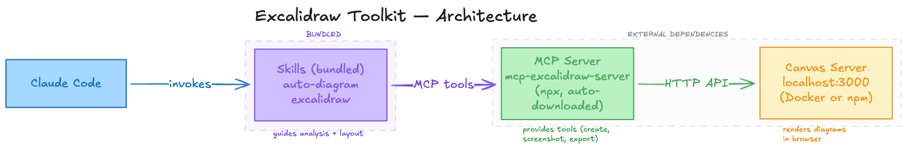

# Excalidraw Toolkit

An AI-powered diagramming toolkit for Claude Code. Say **"diagram this repo"** and watch your codebase turn into an architecture diagram on a live Excalidraw canvas.

```
> diagram this repo

I found 6 components and 5 connections:
  - Next.js Frontend → API Routes (REST)
  - API Routes → Prisma ORM → PostgreSQL (SQL)
  - API Routes → NextAuth (auth) + Stripe API (payments)

Does this look right?

> looks good

[Building diagram on live canvas...]
```

## Install

```bash
npx excalidraw-toolkit init
npx excalidraw-toolkit start
```

Two commands. `init` copies skills to `~/.claude/plugins/` and configures the MCP server. `start` launches the pinned, packaged canvas and opens your browser after its identity and readiness checks pass. Node.js 20 or newer is required; runtime setup does not clone or build a Git repository.

Setup writes the user-scope MCP entry to `~/.claude.json` and records its exact value in `~/.claude/plugins/excalidraw-toolkit/install-state.json`. Other settings and MCP servers are preserved. Invalid JSON or a conflicting `excalidraw` entry stops setup before configuration changes; move or rename the conflicting entry to keep both integrations. Configuration files are replaced atomically with their existing permissions. Symlinked configuration is rejected rather than replaced.

An older entry pointing to this toolkit's own bridge can be migrated from `~/.claude/settings.json`. A generic `npx mcp-excalidraw-server` entry cannot establish ownership and is left intact. Uninstall removes only unchanged owned entries. If an entry was modified or is unowned, it and the installed bridge files are retained and reported for manual inspection.

Setup operations are serialized by a local lock. A crash can leave the lock directory named in the error; remove it only after confirming no setup process is running. Writes also check for intervening changes from other applications, but this is not an atomic transaction with an external editor or across both configuration files. An interrupted upgrade retains the old and intended entry in its ownership record so setup can resume.

Restart Claude Code and try: **"diagram this repo"**

Verify setup with:

```bash
npx excalidraw-toolkit doctor
npx excalidraw-toolkit status --json
```

Run configuration tests with `npm test`. They use temporary home directories and do not start the canvas or write to your real configuration.

<details>
<summary>Alternative: install via Claude Code plugin marketplace</summary>

```bash
/plugin marketplace add edwingao28/excalidraw-skill
/plugin install excalidraw@excalidraw-skill
```

</details>

## What You Get

### Scoped edits to saved diagrams

Install the pinned renderer once, then inspect a native file to obtain its hash, element IDs, and supported operations:

```bash
excalidraw-toolkit setup-preview
excalidraw-toolkit inspect architecture.excalidraw
```

Save a request as `edit.json`, using the returned `baseHash` and target ID:

```json
{
  "requestId": "recolor-api-001",
  "baseHash": "<hash from inspect>",
  "operations": [
    { "op": "setStyle", "targetId": "api", "style": { "backgroundColor": "#a5d8ff" } }
  ]
}
```

```bash
excalidraw-toolkit edit architecture.excalidraw --request edit.json --output results
excalidraw-toolkit preview results/recolor-api-001/receipt.json
```

The command returns a receipt linking `before.excalidraw`, `after.excalidraw`, and
before/after PNG previews. It preserves the input bytes, image assets, unknown
metadata, deleted elements, IDs, order, and every field outside the requested
style properties. Native rendering consumes a separate copy of each scene.

Supported edits currently change fill or stroke colors on rectangles, ellipses,
and diamonds. Use hex RGB/RGBA colors or `transparent`. Other element types pass
through unchanged; targeting them or requesting other operations fails explicitly.

A retry with the same request ID and payload returns its existing verified
bundle. Different payloads under that ID conflict. Failed attempts can be retried;
interrupted attempts recover in a new attempt after their owner exits. Concurrent
attempts return `REQUEST_BUSY`; keep the result directory on the same host.
If the source changed before a new attempt, inspect it again and create a new
request. A completed retry always returns its recorded result, even if the source
subsequently changed. Inspect the previews and reopen the delivered native file
before adopting it; the command does not overwrite an open editor's file.

### Auto-Diagram — Zero-Config Codebase Visualization

Just say **"diagram this repo"**. No description needed.

The auto-diagram skill runs a 6-phase pipeline:
1. **Detect** project type (monorepo, microservices, standard app) and framework (Next.js, Django, Go, Rails, etc.)
2. **Discover** components (frontend, API routes, database, queues, cache, auth, external services)
3. **Map** connections between components (REST, SQL, gRPC, events, imports)
4. **Verify** with you before drawing — presents a summary, asks for confirmation
5. **Choose layout** (vertical flow, horizontal pipeline, hub-and-spoke, or zoned modules)
6. **Generate** the diagram on the live canvas with color-coded components

Works with any language. Context budget prevents blowout on large codebases.

### Agentic Self-Critique

Every diagram goes through an automatic quality check before you see it:

1. **Snapshot** the canvas for rollback safety
2. **Geometric validation** via `query_elements` — detects overlapping shapes, cramped spacing, broken zones
3. **Visual validation** via screenshot — checks arrow labels, text readability, title, centering
4. **Auto-fix** up to 2 rounds. If fixes make things worse, rolls back to the snapshot

You never see a broken diagram. The self-critique loop catches layout issues that would otherwise require manual tweaking.

### Described Diagrams

When you know what you want, describe it:

```
"Draw a microservices architecture with: React frontend, API Gateway,
Auth Service, User Service, Order Service, RabbitMQ, PostgreSQL, Redis"
```

Or trace data flows:

```
"Trace how the auth token flows from login to API request to database query"
```

Or convert from Mermaid:

```
"Create an excalidraw diagram from this mermaid:
graph TD; A[Frontend] -->|REST| B[API]; B -->|SQL| C[Database]"
```

## Examples

Same prompt, two renderers: **Markdown** (Mermaid via `create_from_mermaid`) vs **Excalidraw** (native canvas via `batch_create_elements`).

### Microservices Architecture

| Markdown | Excalidraw |
|:---:|:---:|
|  |  |

### CI/CD Pipeline

| Markdown | Excalidraw |
|:---:|:---:|
|  |  |

### Event-Driven System

| Markdown | Excalidraw |
|:---:|:---:|
|  |  |

### Data Pipeline

| Markdown | Excalidraw |
|:---:|:---:|
|  |  |

## Architecture

The built package includes the skills, pinned backend and rebuilt canvas:

| Layer | What | Bundled? |
|-------|------|----------|
| **Skills** (this package) | Markdown prompts that guide Claude's diagram generation | Yes |
| **MCP Server** ([mcp-excalidraw-server](https://github.com/yctimlin/mcp_excalidraw)) | Backend `2.0.0`, compiled into a Node ESM bundle with its dependencies | Yes — `dist/runtime/bin.mjs`; no first-use download |
| **Canvas Server** ([mcp_excalidraw](https://github.com/yctimlin/mcp_excalidraw)) | Bundled Node server, rebuilt frontend and local fonts; toolkit-owned process on loopback | Yes — `dist/runtime` and `dist/canvas`; no consumer-side clone or build |

Packaging checks the complete pinned upstream JavaScript source digest before
building. `dist/runtime/manifest.json` records source/output hashes and included
dependency versions; `THIRD_PARTY_NOTICES.txt` retains their license notices.
Runtime lookup checks backend identity and entry hashes without generating code
in the user's home or resolving build dependencies. The regular package lock is
used for development/CI; the upstream npm package and esbuild are build-only
dependencies. Consumers install the toolkit's MCP client dependency normally.

Incoming canvas labels load their bundled font faces before layout is measured. If a required font fails to load, scene replacement and backend sync remain paused; after restoring the local assets, reload the page to retry failed browser font faces. Helvetica uses the operating system font rather than a bundled face.



## How It Works

Two skills, one toolkit:

| Skill | Triggers On | Does |
|-------|-------------|------|
| **auto-diagram** | "diagram this repo", "visualize the architecture" | Analyzes codebase, discovers components, generates diagram |
| **excalidraw** | "draw a diagram of X", user provides description/sample | Renders user-specified diagrams with precise layout control |

Both skills use MCP tools to draw on a live Excalidraw canvas:

| Tool | Purpose |
|------|---------|
| `batch_create_elements` | Create all shapes + arrows in one call |
| `get_canvas_screenshot` | Visual verification after each step |
| `query_elements` | Geometric validation for self-critique |
| `snapshot_scene` / `restore_snapshot` | Rollback safety during self-critique |
| `export_to_image` | Save as PNG or SVG |
| `export_scene` | Save as editable `.excalidraw` file |
| `export_to_excalidraw_url` | Generate a shareable link |

## Color Palette

Every component type gets a consistent color:

| Component | Background | Stroke |
|-----------|------------|--------|
| Frontend/UI | `#a5d8ff` | `#1971c2` |
| Backend/API | `#d0bfff` | `#7048e8` |
| Database | `#b2f2bb` | `#2f9e44` |
| AI/ML | `#e599f7` | `#9c36b5` |
| Queue/Event | `#fff3bf` | `#fab005` |
| External API | `#ffc9c9` | `#e03131` |
| Storage | `#ffec99` | `#f08c00` |
| Cache | `#ffe8cc` | `#fd7e14` |
| Zone/Group | `#e9ecef` | `#868e96` |

Cloud-specific palettes (AWS, Azure, GCP, Kubernetes) are included in `references/colors.md`.

## CLI Commands

```bash
npx excalidraw-toolkit init        # install skills + configure MCP server
npx excalidraw-toolkit start       # start packaged canvas server + open browser
npx excalidraw-toolkit stop        # stop canvas server
npx excalidraw-toolkit update      # update unchanged owned installation entries
npx excalidraw-toolkit uninstall   # remove skills + MCP config
npx excalidraw-toolkit doctor      # check installation health
npx excalidraw-toolkit version     # print version
```

## Compatible MCP Servers

The toolkit qualifies its packaged `mcp-excalidraw-server` 2.0.0 backend and its
26 discovered tools. Other server implementations are not qualified by this
installation or readiness contract.

## Requirements

- [Claude Code](https://docs.anthropic.com/en/docs/claude-code) CLI
- Node.js >= 20
- A browser (canvas opens automatically at http://localhost:3000)

## Credits

Created by [@edwingao28](https://github.com/edwingao28) with Claude Code.

## License

MIT
